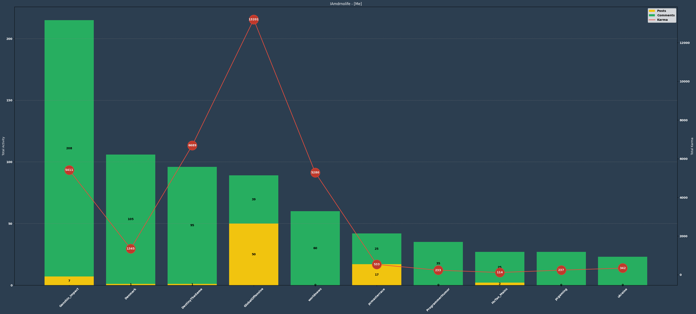
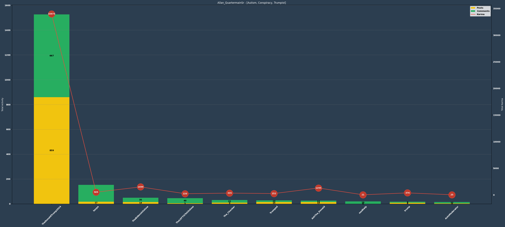

# Reddit User Analyzer
This repository contains a quick and dirty notebook designed for quickly analyzing someone's Reddit profile.

The primary goal of this project is to retrieve as many comments and posts as possible from a user's Reddit account, enabling us to gain insights into their online persona. By examining the subreddits where they are active, as well as the breakdown of their posts versus comments, we can make informed judgments about whether engaging with them is worthwhile.

# Running the Program
When you run the program, it generates a JSON file for the specified user, containing their activity in various subreddits based on their last 1000 comments and posts. The top 10 most active subreddits are then visualized using diagrams.

# Examples
To demonstrate the program's functionality, we provide two examples of running it: one using my Reddit profile, and the other using a profile of a dedicated Trump conspiracy theorist.

Firstly, here's a portion of the JSON generated for my profile:

```json
{
  "Genshin_Impact": {
    "TotalPosts": 7,
    "TotalPostsKarma": 2346,
    "TotalComments": 208,
    "TotalCommentsKarma": 3065,
    "TotalActivity": 215,
    "TotalKarma": 5411
  },
  "Denmark": {
    "TotalPosts": 1,
    "TotalPostsKarma": 1,
    "TotalComments": 105,
    "TotalCommentsKarma": 1344,
    "TotalActivity": 106,
    "TotalKarma": 1345
  },
  "DestinyTheGame": {
    "TotalPosts": 1,
    "TotalPostsKarma": 5713,
    "TotalComments": 95,
    "TotalCommentsKarma": 976,
    "TotalActivity": 96,
    "TotalKarma": 6689
  }
}
```
These data points are then transformed into a diagram representing my user activity, which clearly indicates my most active subreddit is "Genshin_Impact," where I primarily comment rather than post.



We can compare this diagram with that of a conspiracy theorist who is a dedicated Trump supporter:



# How to Use
To use this program, you need to create a JSON file named "settings.json" which should include a "ClientId" and "ClientSecret." It is your responsibility to obtain these credentials from the Reddit API (please note that recent changes by Reddit may impact API availability i.e. these lunatic changes to the pricing).

To register a new app and acquire the necessary credentials, please visit: [Reddit Apps page](https://www.reddit.com/prefs/apps)

Furthermore, you need to set up the list of users to retrieve data from. Here's an example of how to structure the code:

```python
list_of_users = [
    ("I-melted", UserType.Random),
    ("TheAvatar99", UserType.Chad),
    ("krnnz", UserType.Autism),
    ("Its_Cmac", UserType.Autism),
    ("WideEstablishment578", UserType.Boomer),
    ("IAmdrnolife", UserType.Me),
    ("relxp", UserType.Autism),
    ("bad_apiarist", UserType.Autism),
    ("ricochetblue", UserType.Normal),
    ("zerowo_", UserType.Chad),
]
```
Please follow the same structure: an array of tuples where the first element is the username and the last element is the UserType.

Note: The UserType functionality has been temporarily modified due to an unforeseen issue. We may revert to an array of UserTypes in the future. For now, please use the provided structure.

Feel free to explore the code and adapt it to your specific requirements. We hope you find this Reddit User Analyzer useful for gaining insights into Reddit users' activity and interests.